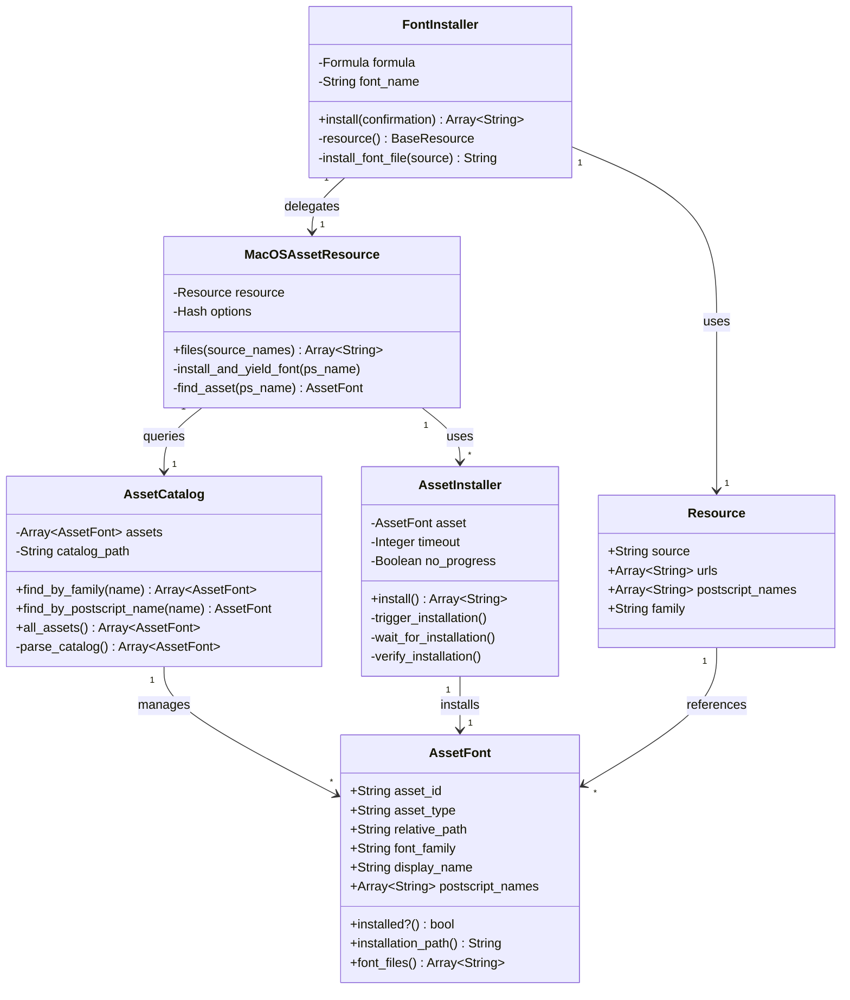
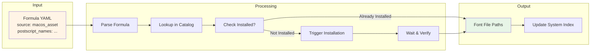
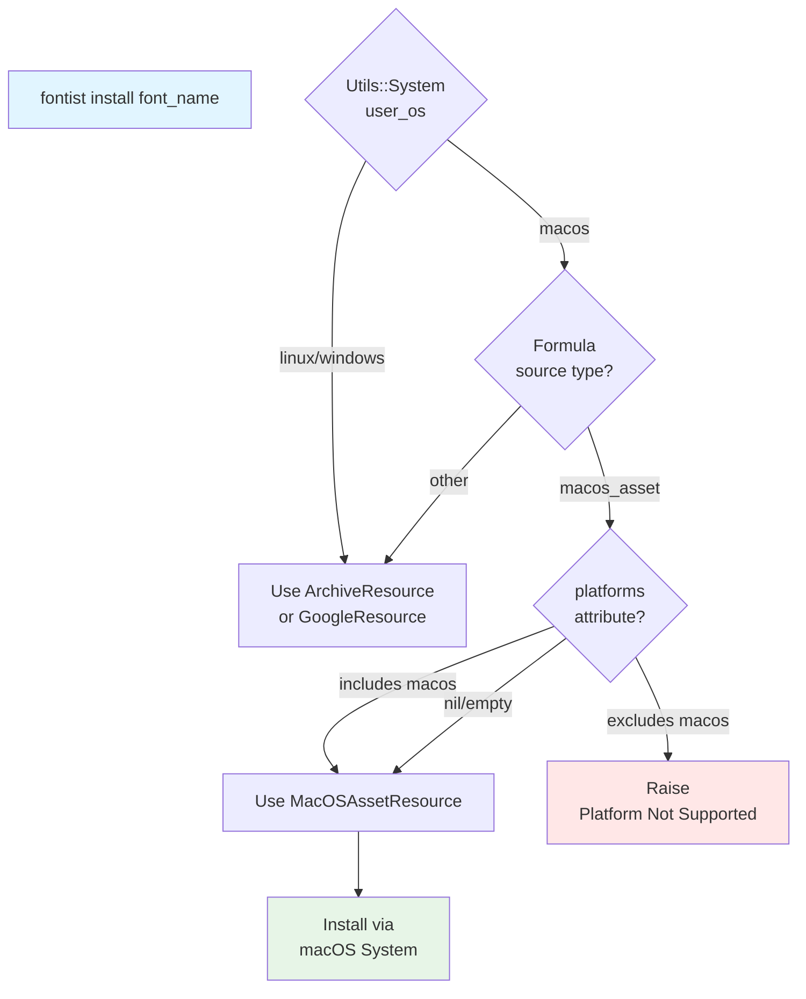
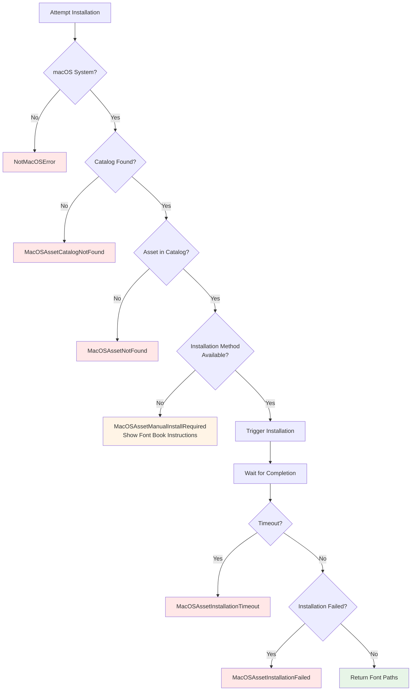
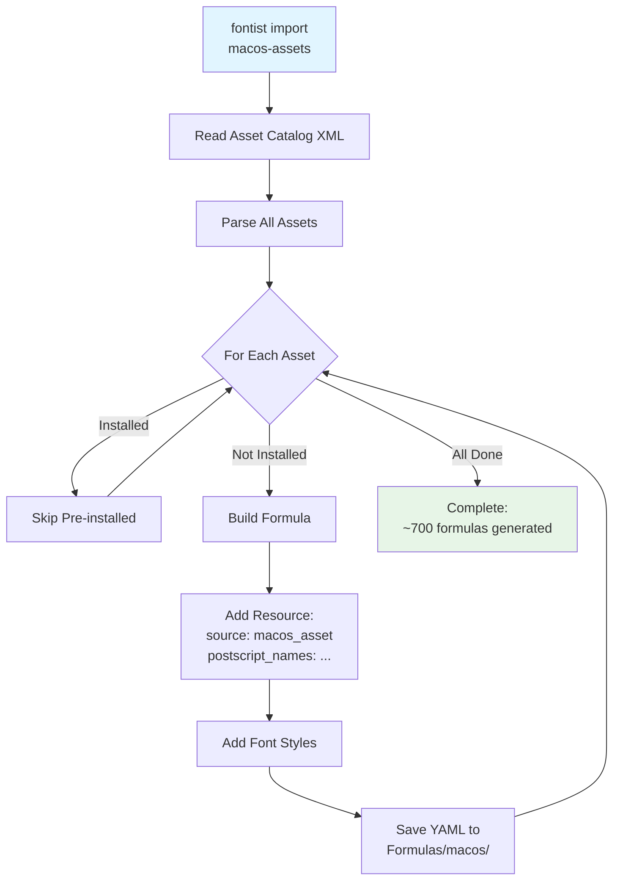

# macOS Add-on Fonts - Visual Architecture

## Component Hierarchy

```mermaid
graph TB
    subgraph "User Interface Layer"
        CLI[fontist CLI<br/>macos commands]
        API[Ruby API<br/>Fontist::Font]
    end
    
    subgraph "Core Logic Layer"
        Font[Fontist::Font<br/>install/find/status]
        Formula[Fontist::Formula<br/>formula lookup]
        FontInstaller[Fontist::FontInstaller<br/>orchestrates installation]
    end
    
    subgraph "Resource Layer"
        MacOSResource[Resources::<br/>MacOSAssetResource<br/>files method]
        ArchiveResource[Resources::<br/>ArchiveResource]
        GoogleResource[Resources::<br/>GoogleResource]
    end
    
    subgraph "macOS Integration Layer"
        AssetCatalog[MacOS::<br/>AssetCatalog<br/>XML parser]
        AssetInstaller[MacOS::<br/>AssetInstaller<br/>system integration]
        AssetFont[MacOS::<br/>AssetFont<br/>Lutaml Model]
    end
    
    subgraph "System Layer"
        XML[/System/Library/<br/>AssetsV2/*.xml]
        Assets[/System/Library/<br/>AssetsV2/*.asset/]
        FontBook[Font Book.app]
    end
    
    CLI --> Font
    API --> Font
    Font --> Formula
    Font --> FontInstaller
    FontInstaller --> MacOSResource
    FontInstaller --> ArchiveResource
    FontInstaller --> GoogleResource
    MacOSResource --> AssetCatalog
    MacOSResource --> AssetInstaller
    AssetCatalog --> AssetFont
    AssetCatalog --> XML
    AssetInstaller --> AssetFont
    AssetInstaller --> Assets
    AssetInstaller -.fallback.-> FontBook
    
    style MacOSResource fill:#e1f5ff
    style AssetCatalog fill:#e1f5ff
    style AssetInstaller fill:#e1f5ff
    style AssetFont fill:#e1f5ff
```

## Installation Flow


## Class Relationships



## Data Flow - Formula to Installed Font



## Platform Detection Flow



## Error Handling Strategy



## Import Process



## Formula Structure Comparison

```mermaid
graph LR
    subgraph "Traditional Formula"
        T1[resources:<br/>  urls: [...]<br/>  sha256: ...]
        T2[fonts:<br/>  styles with files]
        T3[Extract archive<br/>Copy to ~/.fontist]
    end
    
    subgraph "macOS Asset Formula"
        M1[resources:<br/>  source: macos_asset<br/>  postscript_names: [...]<br/>  family: ...]
        M2[fonts:<br/>  styles with PS names]
        M3[Request from system<br/>Stay in system location]
    end
    
    T1 --> T2
    T2 --> T3
    
    M1 --> M2
    M2 --> M3
    
    style T1 fill:#fff
    style T2 fill:#fff
    style T3 fill:#fff
    style M1 fill:#e1f5ff
    style M2 fill:#e1f5ff
    style M3 fill:#e1f5ff